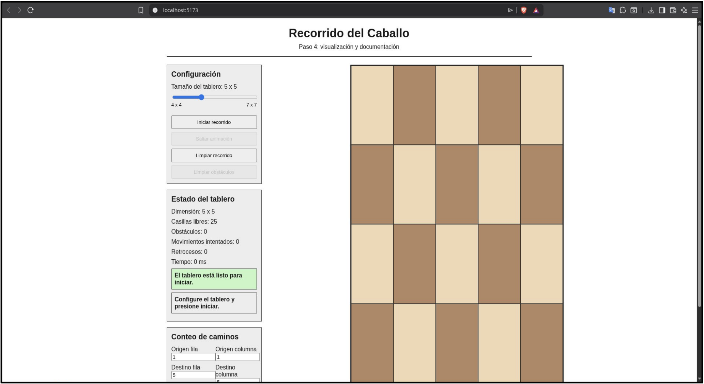
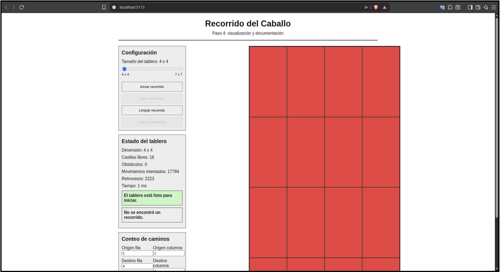
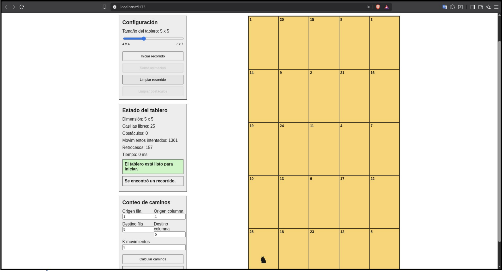
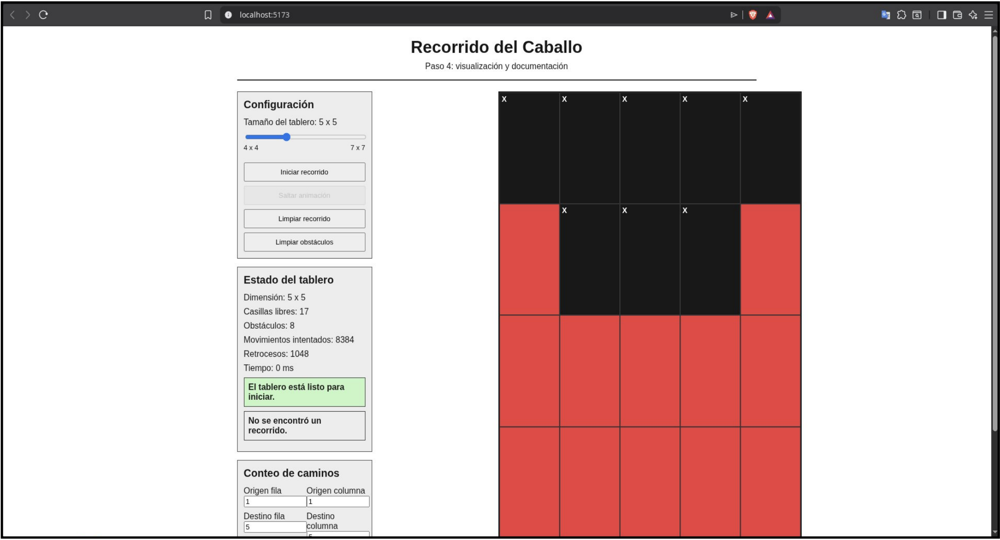
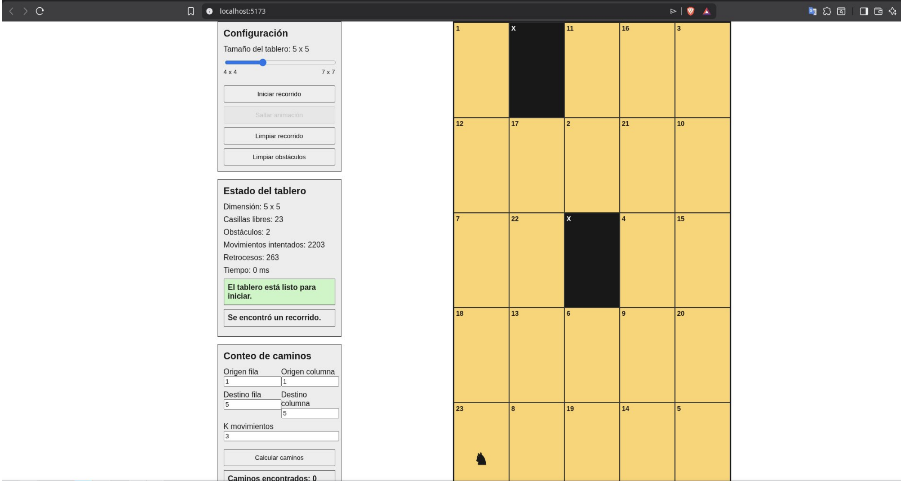
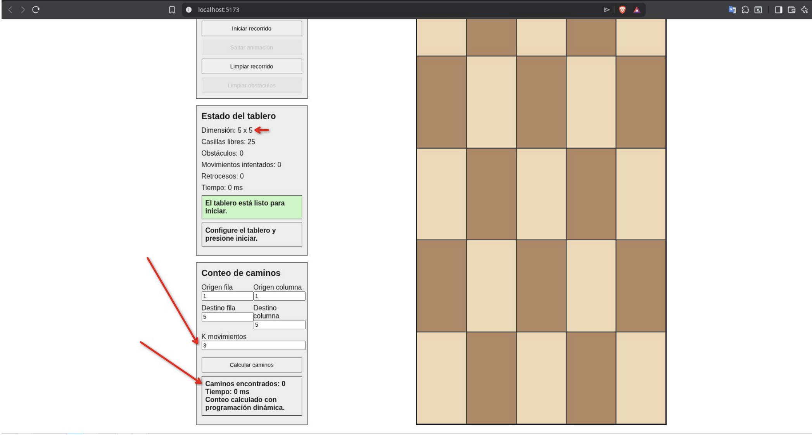
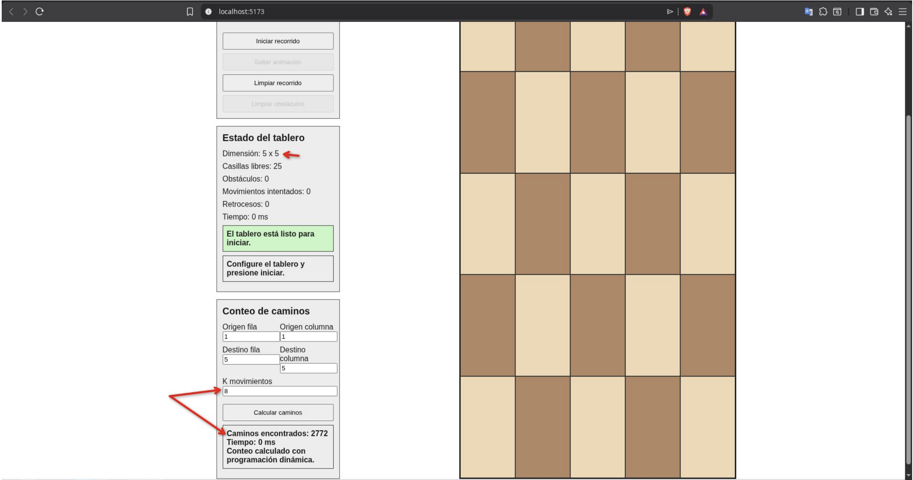

# py-knights-tour

**Autores:**  
Noé López Durón.
Julián Pizarro Castro (GitHub: [@Julian3017](https://github.com/Julian3017)).

---

## 1. Instrucciones de instalación.

Para comenzar, se debe descargar o clonar el repositorio desde GitHub. Abrir una terminal en la carpeta donde se encuentra el proyecto descargado y finalmente instalar las dependencias necesarias. Es importante mencionar, que se debe contar con Node.js instalado previamente. Para instalar las dependencias, se debe escribir el siguiente comando en la terminal:

```bash
npm install
```

Posteriormente, se debe ejecutar el siguiente comando en la terminal para inicializar el servidor de Vite y así poder visualizar el proyecto:

```bash
npm run dev
```

Luego, se debe abrir el navegador con el enlace dado por Vite. Generalmente se muestra en la dirección: `http://localhost:5173/`.

Para generar la “versión de producción” para desplegarse en Github Pages se utiliza el siguiente comando:

```bash
npm run build
```

---

## 2. Uso de la aplicación.

- Seleccionar el tamaño del tablero entre 4x4 y 7x7.
- Marcar obstáculos antes de iniciar el recorrido.
- Presionar el botón Iniciar recorrido para ejecutar el backtracking.
- Observar los avances en verde y los retrocesos en rojo.
- Usar Saltar animación si se desea ver directamente la conclusión.
- Usar el panel de conteo para indicar origen, destino y K movimientos.
- Presionar Calcular caminos para obtener el conteo por programación dinámica.

---

## 3. Descripción del algoritmo de backtracking.

El recorrido del caballo se resuelve mediante un procedimiento de backtracking recursivo implementado en `src/algoritmos/knightsTour.js`. La aplicación separa la resolución del problema y la representación visual. El componente principal prepara el tablero, conserva los obstáculos definidos y delega el cálculo a la función `resolverRecorridoCaballo(tableroLimpio)`. Esta organización permite analizar el algoritmo como una unidad independiente y, posteriormente, utilizar sus resultados para actualizar la interfaz paso a paso.

Para ejecutar la búsqueda, el tablero se convierte en una matriz numérica. En esta representación, las casillas con obstáculo se identifican con el valor `-1`, las casillas libres sin visitar con el valor `0` y las casillas visitadas con el número correspondiente a su orden dentro del recorrido. Esta estructura facilita validar cada movimiento de manera directa, ya que permite distinguir si una posición está bloqueada, disponible o previamente ocupada por el camino.

El recorrido inicia en la primera casilla libre encontrada al recorrer la matriz por filas y columnas. Esta selección permite obtener un comportamiento determinista: ante una misma configuración de tamaño y obstáculos, el algoritmo evalúa las alternativas en el mismo orden y produce el mismo resultado. Además, evita agregar parámetros innecesarios para el objetivo principal del proyecto, que consiste en resolver y visualizar el recorrido completo sobre las casillas disponibles.

La función recursiva mantiene como información principal la posición actual del caballo, el número de visita que corresponde colocar, el total de casillas libres, la matriz de trabajo, el arreglo de pasos y las estadísticas de ejecución. El caso base se alcanza cuando el número de visita supera el total de casillas libres. En ese punto se concluye que todas las casillas permitidas fueron visitadas exactamente una vez y, por lo tanto, el recorrido es válido.

En cada llamada recursiva se evalúan los ocho desplazamientos posibles del caballo. Cada desplazamiento corresponde a un movimiento en forma de L, compuesto por dos casillas en una dirección y una casilla en dirección perpendicular. Antes de aceptar una nueva posición, se verifica que permanezca dentro de los límites del tablero y que la casilla destino tenga valor `0`. De esta forma se impide salir del tablero, caer sobre obstáculos o repetir casillas ya visitadas.

Al encontrar un movimiento válido, la casilla destino se marca con el número de orden correspondiente y se registra un paso de avance. Este registro permite que la interfaz represente posteriormente el proceso de búsqueda, mostrando el avance del caballo y la numeración progresiva del recorrido. Después de marcar la casilla, se invoca nuevamente la función recursiva desde la nueva posición.

Si la llamada recursiva posterior logra completar el tablero, el resultado verdadero se propaga hasta la llamada inicial y el algoritmo finaliza. En cambio, si desde esa posición no es posible completar el recorrido, se realiza el retroceso: la casilla se restaura a `0`, se registra un paso de retroceso y se continúa evaluando el siguiente movimiento disponible. Este mecanismo constituye la esencia del backtracking, ya que permite deshacer decisiones parciales que no conducen a una solución.

Los pasos de avance y retroceso no alteran la validez matemática del algoritmo; su función es documentar la secuencia de decisiones tomada durante la búsqueda. Gracias a estos registros, la interfaz puede reproducir el proceso una vez finalizado el cálculo, coloreando las casillas de avance y retroceso y desplazando la figura del caballo de acuerdo con la evolución del algoritmo.

El cálculo completo se realiza antes de iniciar la animación. Esta decisión permite separar la medición del algoritmo respecto del tiempo empleado por la visualización. Por lo tanto, el tiempo informado corresponde a la resolución del problema y no a la velocidad con que se muestran los pasos en pantalla. Asimismo, permite ofrecer una opción para omitir la animación y presentar directamente el estado final del tablero.

Desde el punto de vista de complejidad temporal, si `L` representa la cantidad de casillas libres, el peor caso del procedimiento puede expresarse mediante una cota `O(8^L)`, debido a que en cada nivel de la búsqueda se pueden analizar hasta ocho movimientos. En la práctica, esta cantidad se reduce mediante las validaciones de límites, obstáculos y casillas visitadas; sin embargo, el problema conserva naturaleza exponencial, especialmente en configuraciones sin solución.

En cuanto a complejidad espacial, la matriz de trabajo requiere `O(N^2)` posiciones, donde `N` es el tamaño del tablero. La profundidad máxima de la recursión es `O(L)`, porque el camino puede contener como máximo una llamada por cada casilla libre. Adicionalmente, el arreglo de pasos puede crecer de manera considerable al almacenar avances y retrocesos, lo cual constituye un costo aceptado para permitir la visualización detallada del proceso.

Cuando no existe una casilla inicial disponible o cuando la exploración completa no logra visitar todas las casillas libres, el resultado se reporta como no solucionado. Esta conclusión se obtiene después de agotar las alternativas posibles según el orden de movimientos definido, garantizando que la respuesta no depende de una interrupción anticipada sino del análisis completo del espacio de búsqueda permitido.

---

## 4. Conteo de caminos con programación dinámica.

El conteo de caminos se implementa en `src/algoritmos/conteoCaminos.js` mediante programación dinámica por tabulación. Este módulo aborda un problema distinto al recorrido completo del caballo: determinar cuántas secuencias de movimientos legales permiten llegar desde una casilla de origen hasta una casilla de destino en exactamente `K` movimientos. Por esta razón, el enfoque utilizado no requiere visitar todas las casillas ni evitar repeticiones, sino contar rutas posibles con una longitud fija.

La función principal recibe como parámetros el tablero, la casilla de origen, la casilla de destino y la cantidad exacta de movimientos. Antes de realizar el cálculo, se valida que `K` sea un entero no negativo, que las coordenadas pertenezcan al tablero y que ni el origen ni el destino correspondan a obstáculos. Estas verificaciones previas aseguran que el conteo se efectúe únicamente sobre configuraciones válidas.

La idea central consiste en almacenar cuántas formas existen de llegar a cada casilla después de una determinada cantidad de movimientos. Para el caso inicial, `K = 0`, solo existe una forma de encontrarse en el tablero: estar en la casilla de origen sin haberse desplazado. Por ello, la primera matriz contiene un `1` en el origen y `0` en todas las demás posiciones.

Para cada movimiento posterior se construye una nueva matriz. Se recorren todas las casillas del tablero y, cuando una casilla posee un conteo mayor que cero en la matriz anterior, dicho conteo se distribuye hacia las casillas que pueden alcanzarse con un movimiento legal de caballo. Si una posición destino es válida, el valor acumulado se suma en la matriz actual. De esta manera, múltiples rutas que llegan a una misma casilla se combinan en un solo valor numérico.

Este procedimiento evita enumerar recursivamente cada secuencia posible de movimientos. En lugar de expandir todos los caminos por separado, se agrupan los resultados intermedios por casilla y por número de movimiento. Esta es precisamente la ventaja de la programación dinámica en este caso: reutilizar información ya calculada para reducir el crecimiento del problema.

Los obstáculos se incorporan como restricciones del tablero. Una ruta no puede iniciar, terminar ni aterrizar sobre una casilla bloqueada. Debido a que el caballo se desplaza mediante saltos, no se consideran casillas intermedias entre el origen y el destino del salto; únicamente se valida la casilla final de cada movimiento. Este criterio mantiene coherencia con la forma real del movimiento del caballo y con la lógica aplicada en el recorrido completo.

Al completar las `K` iteraciones, el valor ubicado en la casilla de destino dentro de la matriz final corresponde al número total de caminos encontrados. Dicho resultado representa secuencias de longitud exacta `K`, por lo que una ruta con menos o más movimientos no forma parte del conteo. También es importante señalar que, en este módulo, una ruta puede pasar varias veces por una misma casilla si los movimientos son legales, ya que el objetivo no es construir un recorrido completo sino contar trayectorias entre dos posiciones.

La interfaz presenta las coordenadas con numeración iniciada en 1 para facilitar la lectura del tablero. Antes de invocar el algoritmo, estas coordenadas se convierten al sistema de índices utilizado por JavaScript, cuyo inicio es 0. Esta conversión mantiene una separación adecuada entre la representación comprensible para quien utiliza la aplicación y la representación interna necesaria para operar sobre arreglos.

La complejidad temporal del algoritmo es `O(K * N^2 * 8)`, ya que se realizan `K` rondas, en cada una se recorren `N^2` casillas y desde cada casilla se analizan hasta ocho movimientos. Al considerar que el número de movimientos posibles del caballo es constante, la expresión se simplifica como `O(K * N^2)`. Este comportamiento resulta más eficiente que una exploración por fuerza bruta, cuyo crecimiento podría aproximarse a `O(8^K)`.

La complejidad espacial es `O(N^2)`, debido a que solo se mantienen dos matrices de tamaño `N x N`: una para los resultados del movimiento anterior y otra para los resultados del movimiento actual. No es necesario conservar todas las etapas intermedias, pues cada nueva capa depende únicamente de la inmediatamente anterior. Esta decisión reduce el uso de memoria sin afectar la exactitud del resultado.

---

## 5. Estructura modular del proyecto.

- `src/algoritmos/knightsTour.js`: backtracking del recorrido del caballo.
- `src/algoritmos/conteoCaminos.js`: conteo de caminos con programación dinámica.
- `src/utils/tablero.js`: funciones auxiliares para tablero, obstáculos, validación y visualización.
- `src/components/`: componentes reutilizables de la interfaz.
- `src/tests/`: pruebas automáticas del recorrido y del conteo de caminos.

---

## 6. Evidencias de funcionamiento.

Se ejecutaron pruebas automáticas para comprobar el funcionamiento del proyecto. Para comprobarlo, se pueden ejecutar los comandos siguientes en la terminal para visualizar el proceso.

```bash
npm run test
npm run lint
npm run build
```

- El tablero 4x4 se detecta como un caso sin solución.
- Los tableros 5x5, 6x6 y 7x7 generan recorridos válidos.
- Cada par de casillas consecutivas del recorrido cumple el movimiento en L del caballo.
- Los obstáculos no son visitados por el caballo.
- El conteo de caminos valida K=0, un movimiento directo, dos movimientos y obstáculos.

A continuación, se muestran las evidencias de funcionamiento a través de capturas.

### Figura 1



*Figura 1: Visualización inicial del tablero y funcionalidades.*

### Figura 2



*Figura 2: Falla en el recorrido con tablero 4x4 sin obstáculos.*

### Figura 3



*Figura 3: Éxito en recorrido con tablero 5x5 sin obstáculos.*

### Figura 4



*Figura 4: Fallo en recorrido con obstáculos con tablero 5x5 (observe las casillas negras representando obstáculos).* 

### Figura 5



*Figura 5: Recorrido exitoso con tablero 5x5 con obstáculos.*

### Figura 6



*Figura 6: Sin caminos encontrados en tablero 5x5 con K=3.*

### Figura 7



*Figura 7: Caminos encontrados con tablero 5x5 con K=8.*

---

## 7. Estadísticas mostradas.

Las estadísticas mostradas tienen como finalidad describir el esfuerzo computacional realizado por el algoritmo de backtracking. Indican si existe o no una solución, pero también permiten observar la magnitud de la búsqueda efectuada para llegar a ese resultado. Por ello, se presentan junto al tablero como un resumen cuantitativo del proceso de resolución. Algunas métricas utilizadas son:

- La cantidad de movimientos intentados.

- La cantidad de retrocesos.

- El tiempo total de ejecución.

La interpretación de estas estadísticas permite analizar los distintos escenarios. Un tablero puede no tener solución y aun así mostrar un número elevado de intentos y retrocesos, porque el algoritmo debe descartar las posibilidades antes de concluir.

Los movimientos intentados y los retrocesos evidencian el crecimiento exponencial del backtracking. La cota teórica `O(8^L)` describe el peor caso, mientras que las estadísticas observadas en una ejecución permiten notar que el tamaño del tablero y los obstáculos dispuestos son relevantes para la misma.

---

## 8. Enlaces.

- **GitHub Pages:** https://duron03.github.io/py-knights-tour/
